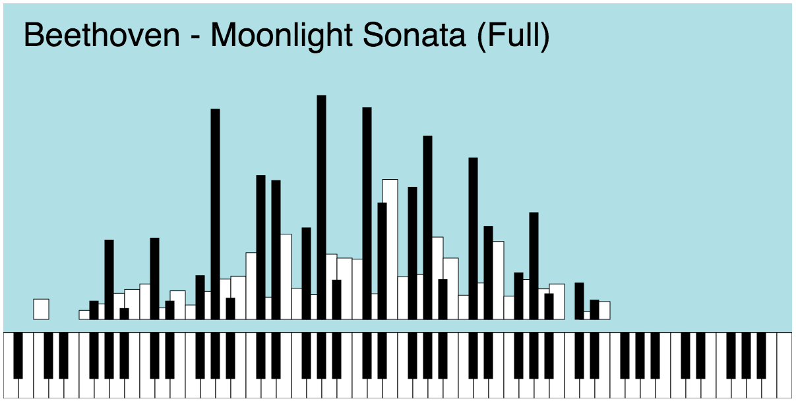

# Score to Chart 

A visualization of musical scores. 

See the [Demo](http://davideoliveri.github.io/ScoreToChart/)

> How many times a note is played on the Moonlight Sonata? 

> How many black keys Chopin used in his compositions? 

A tool to answer those kind of questions, and to raise others.
